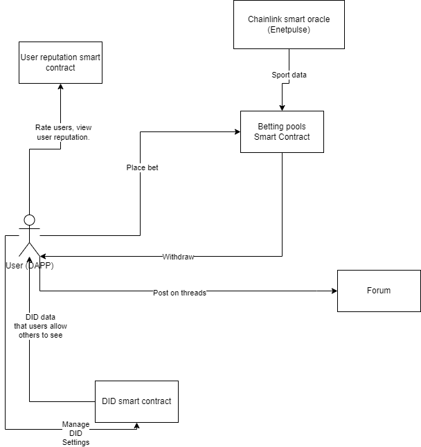

# Peer-to-Peer Betting DApp
This decentralized application (DApp) allows users to create and join peer-to-peer betting pools for soccer events. The DApp uses smart contracts and digital identifiers (DIDs) to facilitate secure and transparent betting transactions. This repository features smart contracts and the frontend application for interacting with the smart contracts. Smart contract addresses can be seen in addresses.txt and you can look their transactions up in [mumbai explorer](https://mumbai.polygonscan.com/).

## Features
- Users control their information through DIDs.
- Create and join peer-to-peer betting pools for various sports events.
- Automated event result determination using smart oracles.
- Secure and transparent betting transactions through smart contracts.
- Reputation system for users to rate and review each other's betting behavior.
- Forum threads for users to communicate with each other.

## Application diagram

## Current status of Enetpulse smart oracle
The Enetpulse smart oracle is currently not working as intended as the offchain API has a long response time (hours or even days). To move to another Smart oracle provider or to use an API call from smart contract, the Betting and Consumer smart contracts will need to be rewritten. For now to test the functionalities of betting pools, existing data on the Consumer smart contracts can be used (more info is in the CreatePools page when you start the app). More info on the smart oracle can be seen [here](https://market.link/nodes/Enetpulse/integrations).

## How to use
- Given the current situation with the API from the smart oracle, users can create the betting pools with data that was gathered from the smart oracles previously. This can be done in the CreatePools page.
- When the betting pools are created, the users can bet on the pools and the owner of the pool can then settle it and after that users that won can withdraw their winnings.
- Users can vote on the reputation of other users which will also incentivize pool owners to not have high fees for their pools.
- Users can create forum threads and other users can post on the threads. This is all done via a smart contract.
- Every user can also set their visible and private DID information and everyone can go look at the visible DID information that a user has set.

## Getting started
1. Clone the repo.
2. Install dependencies with `npm install`.
3. Move to front-end directory with `cd front-end`.
4. Start the application with `npm start`.

## Usage requirements
1. To use the application you need to install metamask, you can do that by going [here](https://metamask.io/download/).
2. Then you need to add mumbai network, which you can do [here](https://wiki.polygon.technology/docs/develop/metamask/config-polygon-on-metamask/).
3. Lastly you need to obtain some matic mumbai testnet tokens, which you can do [here](https://faucet.polygon.technology/) or [here](https://mumbaifaucet.com/).

## Work done
1. Jurij Kolenik: Enetpulse research, betting, forum smart contracs and frontend. Reports.
2. Patrik Marčok: DID, reputation smart contracts and frontend. Reports.

